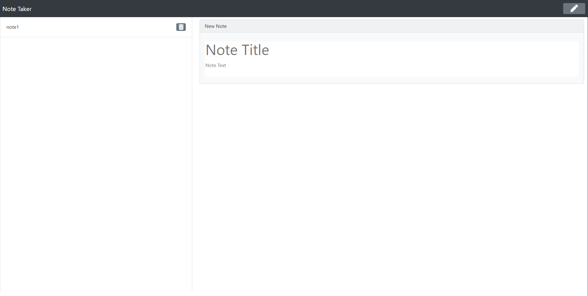
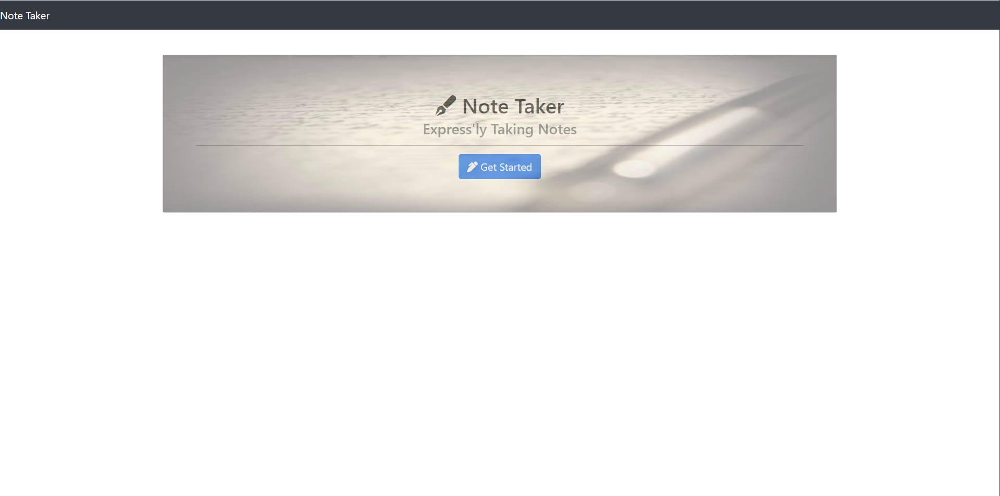

# Note Taker

Note Taker is a website that allows you to write, save, and delete personal notes

## 🏁 Getting started

#### Cloning

1. [Fork this repository](https://help.github.com/en/articles/fork-a-repo).
1. [Clone the forked repository](https://help.github.com/en/articles/cloning-a-repository) locally
1. Run `npm install` to install dependencies

Inside the repository directory, you will find two key folders:

- **[`app`](/app):** contains the JSON database for the notes.
- **[`public`](/public):** contains the HTML, CSS and script.js files.

## 💥 Issues

The main challenges were figuring out how to manipuate the JSON database without changing the content. I learned alot about express, fs, uuid, json when trying to make this project work.

## Contribution:

[Code of Conduct](./CODE_OF_CONDUCT.md)

## 👌 Collaborators

With instruction from [Filipe Laborde-Basto](https://github.com/c0dehot) and [Daniel Cabellos](https://github.com/shibeknight)

## License:

For more information about the license, click on the link below.

- [License](https://choosealicense.com/licenses/mit/)

## ❔ Questions:

For questions about this project you can go to my GitHub page at the following link:

- [GitHub Profile](https://github.com/Halvosaurus34)

For additional questions please reach out to me at: lhalvorson34@gmail.com.

---

## Links

[Deployed Note Taker Website](https://powerful-citadel-42030.herokuapp.com/)

---

[Note Taker GitHub Repository](https://github.com/Halvosaurus34/Note-Taker)

---

I used [Express](https://www.npmjs.com/package/express), [UUID](https://www.npmjs.com/package/uuid), [fs](https://www.w3schools.com/nodejs/nodejs_filesystem.asp) to build this web app.

---

## 👀 Screenshots

---

---
